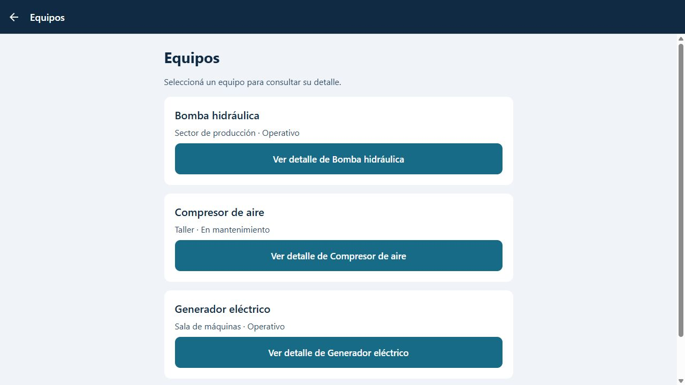
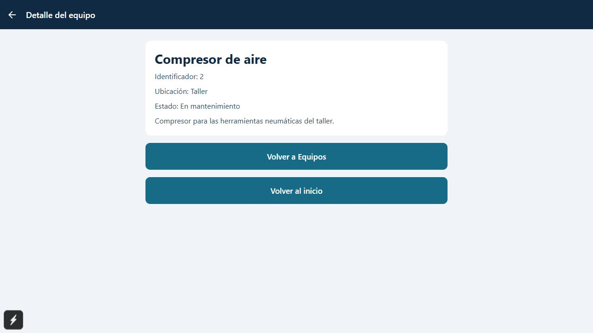
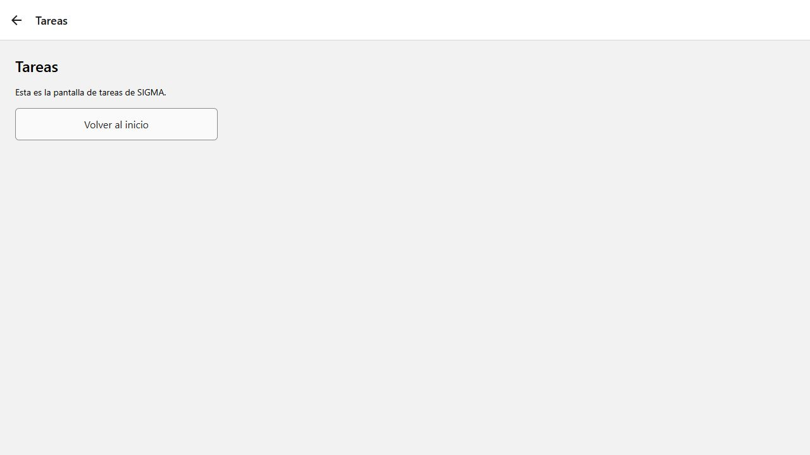
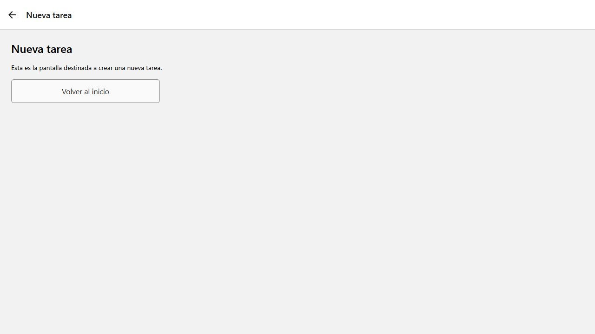

# SIGMA · Navegación con Expo Router

Aplicación de práctica para gestionar equipos y tareas de mantenimiento. Implementa la actividad de navegación: un menú de inicio con **Equipos**, **Tareas** y **Nueva tarea**, enlaces mediante `Link` y una pantalla dinámica de detalle de equipos.

**Repositorio público:** [ericVignolo/ProyectoSIGMA](https://github.com/ericVignolo/ProyectoSIGMA).

## Funcionalidades

- Menú principal con las tres opciones solicitadas.
- Navegación mediante `Link` y una pila de pantallas con `Stack`.
- Listado de tres equipos y detalle individual mediante la ruta `/equipos/[id]`.
- Mensaje de equipo no encontrado para identificadores inexistentes.
- Listado de tareas y formulario para crear una tarea asociada a un equipo.
- Validación de la descripción antes de guardar.
- Botones para volver al inicio y al listado de equipos.

## Tecnologías

React Native, Expo SDK 57, Expo Router, React y TypeScript. Los estilos se definen con `StyleSheet` y las tareas se comparten entre pantallas mediante Context API.

## Requisitos y ejecución

- Node.js y npm.
- Un navegador para la versión web o un dispositivo/emulador compatible con la versión de Expo del proyecto.
- El proyecto utiliza Expo SDK 57, siguiendo los ejemplos de clase.

Clonar el repositorio y entrar a su carpeta:

```bash
git clone https://github.com/ericVignolo/ProyectoSIGMA.git
cd ProyectoSIGMA
```

Instalar las dependencias e iniciar Expo:

```bash
npm install
npm run start
```

Para abrir la aplicación en un teléfono, escaneá el QR con una versión de Expo Go compatible con SDK 57. El teléfono y la computadora deben poder conectarse entre sí por la red. Para usar un emulador Android, iniciarlo previamente y presionar `a` en la terminal de Expo.

Para ejecutar la versión web:

```bash
npm run web
```

Abrir la dirección que indique Expo en la terminal. Si el navegador no se abre automáticamente, presionar `w`.

Para comprobar los tipos:

```bash
npm run typecheck
```

## Pantallas y estructura

```text
app/
  _layout.tsx        Stack de navegación y proveedor de tareas
  index.tsx          Menú de inicio
  equipos/
    index.tsx        Listado de equipos
    [id].tsx         Detalle por identificador
  tareas.tsx         Listado de tareas
  nueva-tarea.tsx    Formulario de creación
components/UI.tsx   Componentes y estilos compartidos
context/            Estado compartido de tareas
data/equipos.ts     Equipos de ejemplo
docs/capturas/      Capturas de la aplicación
app.json            Configuración de Expo
package.json        Dependencias y comandos
package-lock.json   Versiones fijadas de las dependencias
tsconfig.json       Configuración de TypeScript
.gitignore          Exclusiones del repositorio
```

| Pantalla | Ruta | Archivo |
| --- | --- | --- |
| Inicio | `/` | `app/index.tsx` |
| Equipos | `/equipos` | `app/equipos/index.tsx` |
| Detalle de equipo | `/equipos/1`, `/equipos/2`, `/equipos/3` | `app/equipos/[id].tsx` |
| Tareas | `/tareas` | `app/tareas.tsx` |
| Nueva tarea | `/nueva-tarea` | `app/nueva-tarea.tsx` |

Cada botón de navegación utiliza el componente `NavButton`, que combina `Link` de Expo Router con `Pressable` mediante `asChild`. En el listado de equipos se pasa `pathname: '/equipos/[id]'` y el parámetro `id`. La pantalla `[id].tsx` obtiene ese parámetro con `useLocalSearchParams` y busca el equipo correspondiente. Por ejemplo, `/equipos/2` muestra el compresor de aire. Un identificador desconocido muestra “Equipo no encontrado”.

El formulario permite seleccionar un equipo y guardar una tarea con descripción obligatoria. Después de guardarla, `router.replace('/tareas')` muestra el listado actualizado. Las tareas se mantienen en memoria: al recargar la aplicación se restablecen los datos de ejemplo. No se requiere una API ni una base de datos.

## Verificación de la actividad

1. Abrir Inicio y comprobar sus tres botones.
2. Pulsar Equipos y abrir el detalle de cada equipo. Verificar que cambian nombre, identificador, ubicación y estado.
3. Volver al inicio y abrir Tareas.
4. Abrir Nueva tarea, seleccionar un equipo y guardar una descripción. Verificar que aparece en Tareas.
5. Intentar guardar una descripción vacía y comprobar el mensaje de validación.
6. En web, visitar `/equipos/999` y comprobar el mensaje de equipo no encontrado.

## Capturas de pantalla

Capturas reales de la versión web en ejecución:

### Inicio


### Equipos



### Detalle mediante ruta dinámica



### Tareas



### Nueva tarea



## Comprobaciones realizadas

- `npm run typecheck`: sin errores.
- Navegación desde Inicio a Equipos y Nueva tarea en el navegador.
- Selección del compresor: abre `/equipos/2` y muestra sus datos.
- Descripción vacía: muestra el mensaje de validación.
- Creación de “Inspeccionar generador”: aparece en Tareas asociada al generador.
- `/equipos/999`: muestra “Equipo no encontrado”.

Estas comprobaciones se realizaron en la versión web. Las capturas documentan ese entorno de ejecución.

## Historial de desarrollo

El historial registra las etapas de configuración, implementación de la navegación, documentación, fijación de dependencias y agregado de capturas. Se puede consultar en [los commits del repositorio](https://github.com/ericVignolo/ProyectoSIGMA/commits/main/) o desde la terminal:

```bash
git log --oneline
```

## Archivos del repositorio

El repositorio incluye el código fuente, la configuración, este README, las capturas y `package-lock.json` para reproducir las versiones instaladas.

`.gitignore` excluye `node_modules/`, `.expo/`, `dist/`, `web-build/`, archivos de registro y archivos de entorno. Las dependencias se generan localmente al ejecutar `npm install`.

## URL de entrega

[https://github.com/ericVignolo/ProyectoSIGMA](https://github.com/ericVignolo/ProyectoSIGMA)
