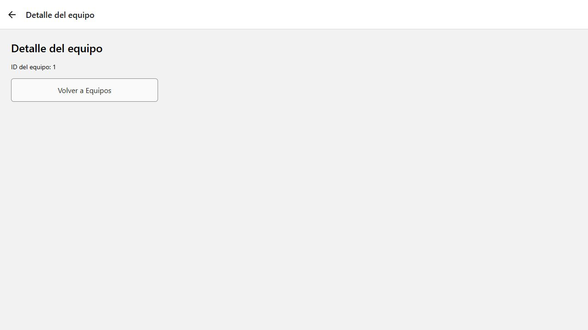

# SIGMA · Navegación con Expo Router

Proyecto de práctica de navegación para SIGMA, una aplicación de gestión de mantenimiento.

**Repositorio público:** [ericVignolo/ProyectoSIGMA](https://github.com/ericVignolo/ProyectoSIGMA).

## Funcionalidades

- Menú inicial con Equipos, Tareas y Nueva tarea.
- Navegación con `Link` y `Stack` de Expo Router.
- Dos equipos seleccionables.
- Detalle que muestra el ID recibido mediante `[id].tsx`.
- Enlaces para regresar entre pantallas.

Tareas y Nueva tarea son pantallas de presentación. El alcance de esta actividad es la navegación; no se crean ni almacenan tareas.

## Tecnologías

React Native, Expo SDK 57, Expo Router, React y TypeScript. Se utilizan componentes básicos y estilos sencillos: botones con borde, fondo claro y separación entre elementos. Los estilos se comparten desde `styles.ts`.

## Cómo ejecutarlo

Se necesita Node.js y npm.

```bash
git clone https://github.com/ericVignolo/ProyectoSIGMA.git
cd ProyectoSIGMA
npm install
npm run start
```

En un teléfono, escanear el QR con Expo Go compatible con SDK 57. El dispositivo y la computadora deben poder conectarse por la red. Para usar un emulador Android, iniciarlo y presionar `a` en la terminal de Expo.

Para ejecutar en el navegador:

```bash
npm run web
```

Abrir la dirección indicada por Expo. Para comprobar los tipos:

```bash
npm run typecheck
```

## Estructura

```text
app/
  _layout.tsx       Stack de navegación
  index.tsx         Menú principal
  equipos/
    index.tsx       Selección de equipos
    [id].tsx        Detalle por ID
  tareas.tsx        Pantalla de tareas
  nueva-tarea.tsx   Pantalla de nueva tarea
docs/capturas/      Capturas de la versión web
app.json            Configuración de Expo
package.json        Dependencias y comandos
package-lock.json   Versiones fijadas de las dependencias
tsconfig.json       Configuración de TypeScript
styles.ts           Estilos básicos de las pantallas y botones
.gitignore          Exclusiones de Git
```

## Navegación

Expo Router genera las rutas a partir de los archivos en `app/`. El menú usa `Link` con `asChild` para que cada `Pressable` navegue al tocar su texto.

Los enlaces de Equipos utilizan `pathname: '/equipos/[id]'` y envían el ID mediante `params`. Equipo 1 abre `/equipos/1` y Equipo 2 abre `/equipos/2`. La pantalla `[id].tsx` obtiene el parámetro con `useLocalSearchParams` y lo muestra.

`_layout.tsx` configura el `Stack`, que organiza las pantallas, sus títulos y el botón de regreso.

## Verificación

1. Desde Inicio, abrir Equipos.
2. Seleccionar Equipo 1 y comprobar que el detalle muestra ID 1.
3. Volver a Equipos, seleccionar Equipo 2 y comprobar que muestra ID 2.
4. Volver al inicio y abrir Tareas.
5. Volver al inicio y abrir Nueva tarea.

Las capturas documentan la versión web. La comprobación de TypeScript se ejecuta con `npm run typecheck`.

## Capturas

### Inicio


### Equipos


### Detalle de Equipo 1



### Detalle de Equipo 2


### Tareas


### Nueva tarea


## Archivos y commits

`.gitignore` excluye `node_modules/`, `.expo/`, compilaciones, registros y archivos de entorno. `package-lock.json` se incluye para reproducir la instalación.

El historial conserva las etapas de desarrollo y la simplificación de la aplicación. Consultarlo en [GitHub](https://github.com/ericVignolo/ProyectoSIGMA/commits/main/) o ejecutar:

```bash
git log --oneline
```

## Entrega

[https://github.com/ericVignolo/ProyectoSIGMA](https://github.com/ericVignolo/ProyectoSIGMA)
